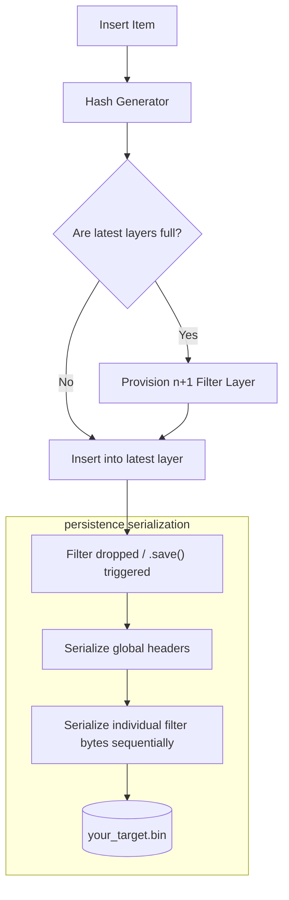

# quickbloom


**`quickbloom`** is an industry-grade, highly scalable, and concurrent Bloom Filter library for Rust. Unlike generic implementations, it allows for unbounded layer growth, multi-threaded access without locking overhead, and fully deterministic file-based serialization right out of the box.

## Features

- **Standard `BloomFilter`**: Insanely fast, statically sized, double-hashing probabilistic set.
- **`ScalableBloomFilter`**: Automatically provisions new capacity layers as it fills up, meaning your false-positive probability never deteriorates, no matter how much data you feed it.
- **`ConcurrentBloomFilter`**: Wrap your filter seamlessly for multi-threaded systems.
- **Auto-Persistence**: Choose any absolute or relative path, and `quickbloom` handles caching data there—saving exactly when it `Drop`s out of scope without blocking insertions.

## Installation

Add this to your `Cargo.toml`:

```toml
[dependencies]
quickbloom = "0.1.0"
```

## Quick Start

### Scalable & Persistent Filter
A scalable filter automatically calculates its sizes mathematically using the provided configuration, and manages file saves seamlessly on the path provided.

```rust
use quickbloom::{ScalableBloomFilter, BloomConfig};

// Define our statistical threshold expectations (e.g. 1 Million items, 1% FP Rate)
let config = BloomConfig::new(1_000_000, 0.01);

// Load from path or create a new one based on the config.
// It auto-saves here when dropped!
let mut filter = ScalableBloomFilter::load_or_new("my_scalable_data.bin", config);

filter.insert(&"alice");

assert!(filter.contains(&"alice"));
assert!(!filter.contains(&"bob"));
```

### Concurrent Environment Threading
Wrap filters effortlessly to stream data into them across threads:

```rust
use quickbloom::{BloomFilter, ConcurrentBloomFilter};

// Create a thread-safe wrapper
let filter = BloomFilter::new(10_000, 7);
let concurrent_filter = ConcurrentBloomFilter::new(filter);

let threaded_ref = concurrent_filter.clone();
std::thread::spawn(move || {
    // Uses an internal RwLock optimization
    threaded_ref.write(|f| f.insert(&"concurrent_data"));
}).join().unwrap();

assert!(concurrent_filter.read(|f| f.contains(&"concurrent_data")));
```

## Architecture

Below represents the memory-to-disk projection handling scaling segments without manual memory alignment problems.



## Authors
- Rasesh Shetty 

## License

MIT License. See the `LICENSE` file for more details.
